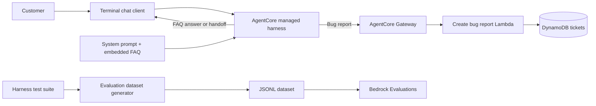
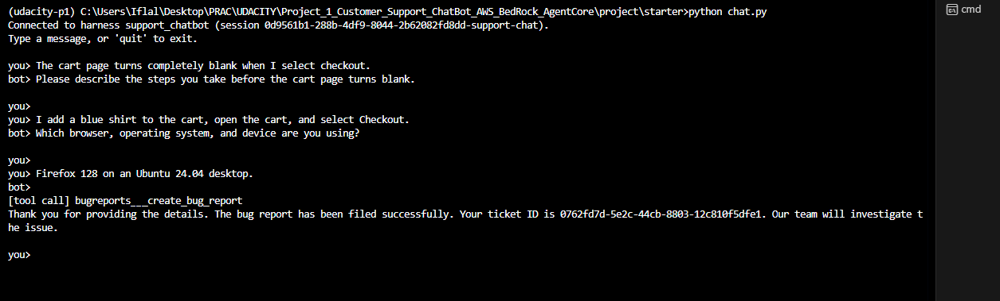

# Customer Support Chatbot with Amazon Bedrock AgentCore

An AWS-based customer-support chatbot that routes each customer message to one of three behaviors:

- collect a complete bug report and create a ticket;
- answer supported platform questions from an embedded FAQ; or
- redirect unsupported requests to human support.

The project uses an Amazon Bedrock AgentCore managed harness for the agent loop and session memory, an AgentCore Gateway for tool access, AWS Lambda for ticket creation, and Amazon DynamoDB for ticket storage. An automated evaluation suite tests routing, FAQ grounding, multi-turn information collection, ambiguous requests, and prompt-injection handling.

This repository was completed as Project 1 of the Udacity Agentic AI Engineer Nanodegree.

## Results

- Bedrock evaluation correctness: **1.0**
- Test records passing: **7 of 7**
- Bug tickets are created only after the customer supplies a description, reproduction steps, and environment.
- FAQ responses are grounded in `online_shop_faq.md`.
- Unsupported and prompt-injection requests are redirected without performing the embedded request.

The evaluation artifacts and screenshots are available in [`project/starter/evidence`](project/starter/evidence/).

## Architecture



The routing logic lives in a single system prompt. The harness supplies model invocation, stateful conversations, and tool execution; it does not use a separate classifier or condition graph.

## Key design decisions

### Deterministic routing

[`system_prompt.txt`](project/starter/system_prompt.txt) defines three mutually exclusive routes: `BUG_REPORT`, `PLATFORM_QUESTION`, and `HUMAN_HANDOFF`. A concrete malfunction takes priority when a message combines a general question with a bug report.

### Safe multi-turn bug collection

The assistant collects these required fields across the conversation:

1. `description`
2. `stepsToReproduce`
3. `environment`

It asks for one missing field at a time and calls `bugreports___create_bug_report` only when all three values came from the customer's messages. The Lambda also rejects empty values and placeholders such as `Unknown`, `N/A`, and `not provided` as a server-side safeguard.

### FAQ grounding and handoff

[`create_harness.py`](project/starter/create_harness.py) replaces the `{{FAQ}}` placeholder in the system prompt with [`online_shop_faq.md`](project/starter/online_shop_faq.md). The assistant may answer platform questions only when the FAQ supports the answer. Other requests are sent to the configured human-support phone line.

### Session isolation

The chat and evaluation clients use a unique `actorId` for each session. This preserves multi-turn history inside one conversation while preventing managed-memory retrieval from leaking context between independent chats or test records.

## AWS services

| Service                                  | Purpose                                            |
| ---------------------------------------- | -------------------------------------------------- |
| Amazon Bedrock AgentCore managed harness | Runs the model, conversation state, and agent loop |
| Amazon Bedrock AgentCore Gateway         | Exposes the Lambda function as an MCP tool         |
| Amazon Nova Pro                          | Foundation model used by the harness and evaluator |
| AWS Lambda                               | Validates and creates bug-report tickets           |
| Amazon DynamoDB                          | Stores tickets and their status                    |
| Amazon S3                                | Stores evaluation input and result artifacts       |
| Amazon Bedrock Evaluations               | Runs the correctness evaluation                    |
| AWS CloudFormation                       | Provisions the tool and evaluation infrastructure  |

## Repository structure

```text
.
├── project/starter/                 # Working implementation and full evidence
│   ├── system_prompt.txt            # Routing, collection, grounding, and safety rules
│   ├── online_shop_faq.md           # FAQ embedded into the system prompt
│   ├── cloudformation-tool.yaml     # DynamoDB, Lambda, and AgentCore IAM roles
│   ├── setup_gateway.py             # Creates the gateway and Lambda tool target
│   ├── create_harness.py            # Creates or updates the managed harness
│   ├── chat.py                      # Multi-turn terminal client
│   ├── harness-tests.json           # Seven automated behavior tests
│   ├── generate-eval-dataset.py     # Produces the Bedrock evaluation JSONL
│   ├── cloudformation-testing.yaml  # Evaluation S3 bucket and IAM role
│   ├── cleanup_agentcore.py         # Removes the harness and gateway resources
│   └── evidence/                    # Screenshots and verification records
├── Udacity_Project_1_Submission/    # Clean copy of the submitted project files
└── Project_Document/                # Project brief, rubric, and course instructions
```

## Prerequisites

- Python 3.9 or later
- Conda or another Python virtual-environment tool
- AWS CLI v2
- An AWS account with access to Amazon Bedrock and Bedrock AgentCore
- Access to the `us.amazon.nova-pro-v1:0` inference profile
- Permission to create CloudFormation, IAM, Lambda, DynamoDB, S3, Bedrock, and AgentCore resources in `us-east-1`

The pinned Python dependencies are listed in [`requirements.txt`](project/starter/requirements.txt).

## AWS profile isolation

Use a dedicated AWS CLI profile so course credentials do not replace a personal or company profile. After configuring a profile named `udacity-agentcore`, verify it before deploying:

```powershell
aws sts get-caller-identity --profile udacity-agentcore --region us-east-1
```

Select that profile for the current PowerShell session so both the AWS CLI and `boto3` scripts use it:

```powershell
$env:AWS_PROFILE = "udacity-agentcore"
$env:AWS_REGION = "us-east-1"
```

For Bash or zsh:

```bash
export AWS_PROFILE=udacity-agentcore
export AWS_REGION=us-east-1
```

Udacity lab credentials are temporary. Refresh the access key, secret key, and session token for this profile if `sts get-caller-identity` reports an invalid or expired token.

## Local setup

Run all project commands from `project/starter`:

```powershell
cd project/starter
conda create --name udacity-p1 python=3.12 -y
conda activate udacity-p1
python -m pip install -r requirements.txt
```

Confirm that the required SDK is available:

```powershell
python -c "import boto3; print(boto3.__version__)"
```

## Deployment

### 1. Deploy the tool infrastructure

```powershell
aws cloudformation deploy `
  --template-file cloudformation-tool.yaml `
  --stack-name bug-report-tool-stack `
  --capabilities CAPABILITY_NAMED_IAM `
  --region us-east-1
```

This stack creates the DynamoDB table, Lambda function, Lambda execution role, gateway role, and harness execution role.

### 2. Create the AgentCore Gateway

```powershell
python setup_gateway.py
```

The script reads the CloudFormation outputs, creates an AWS IAM-authorized MCP gateway, registers the Lambda target, and writes the resource configuration to `agentcore_config.json`.

### 3. Create the managed harness

```powershell
python create_harness.py
```

This expands `{{FAQ}}`, pins Amazon Nova Pro, creates or updates the harness, waits until it is ready, and adds the harness details to `agentcore_config.json`.

### 4. Chat with the agent

```powershell
python chat.py
```

Each run starts a fresh conversation. During a successful bug-report flow, the client prints the tool call before returning the generated ticket ID.



## Testing and evaluation

Generate fresh model responses for all seven cases:

```powershell
python generate-eval-dataset.py --tests-json harness-tests.json
```

The command writes [`output_eval_dataset.jsonl`](project/starter/output_eval_dataset.jsonl). Each record contains a customer prompt, the expected behavior, and the harness response. The test suite covers:

- incomplete bug reports;
- informal reproduction steps;
- order-tracking and payment FAQs;
- unrelated requests;
- ambiguous messages containing a concrete malfunction; and
- prompt-injection attempts.

Deploy the evaluation infrastructure:

```powershell
aws cloudformation deploy `
  --template-file cloudformation-testing.yaml `
  --stack-name bug-report-testing-stack `
  --capabilities CAPABILITY_NAMED_IAM `
  --region us-east-1
```

Upload the JSONL dataset to the bucket returned by the stack, then create a Bring Your Own Inference evaluation job using the `Builtin.Correctness` metric. The complete AWS CLI and console workflow is documented in [`Project_Document/Testing_Frameworks.md`](Project_Document/Testing_Frameworks.md).

The completed evaluation scored every record at `1.0`. See [`VERIFICATION.md`](project/starter/evidence/VERIFICATION.md) for the recorded test results and transcripts.

## Security and public-repository checks

- `agentcore_config.json` is ignored because it contains account-specific resource identifiers.
- Never commit `.aws/credentials`, access keys, secret keys, session tokens, or `.env` files.
- Temporary lab credentials should remain only in your local AWS credentials file.
- AWS account IDs and ARNs are not authentication secrets, but they can identify an account. Review screenshots and raw evaluation metadata before publishing them publicly.
- The Lambda validates tool input independently instead of relying only on model behavior.

## Cleanup

AWS resources can continue to incur charges. Remove the AgentCore resources first:

```powershell
python cleanup_agentcore.py
```

Empty the evaluation bucket before deleting its CloudFormation stack:

```powershell
aws s3 rm s3://<EvalDatasetBucketName> --recursive --region us-east-1
aws cloudformation delete-stack --stack-name bug-report-testing-stack --region us-east-1
aws cloudformation delete-stack --stack-name bug-report-tool-stack --region us-east-1
```

Wait for deletion to finish before assuming all resources have been removed.

## Evidence

| Scenario                                  | Evidence                                                                                                                                                                                 |
| ----------------------------------------- | ---------------------------------------------------------------------------------------------------------------------------------------------------------------------------------------- |
| System prompt routing and safety rules    | [`01`](project/starter/evidence/ScreenShots/01-system-prompt-routing-and-bug-rules.png), [`02`](project/starter/evidence/ScreenShots/02-system-prompt-faq-handoff-and-enforcement.png) |
| Multi-turn bug report and tool invocation | [`03`](project/starter/evidence/ScreenShots/03-multi-turn-bug-report-tool-call.png)                                                                                                     |
| Persisted DynamoDB tickets                | [`04`](project/starter/evidence/ScreenShots/04-dynamodb-bug-report-tickets.png)                                                                                                         |
| FAQ-grounded order tracking               | [`05`](project/starter/evidence/ScreenShots/05-faq-order-tracking-response.png)                                                                                                         |
| Unsupported platform question handoff     | [`06`](project/starter/evidence/ScreenShots/06-uncovered-platform-question-handoff.png)                                                                                                 |
| Out-of-scope request handoff              | [`07`](project/starter/evidence/ScreenShots/07-out-of-scope-human-handoff.png)                                                                                                          |
| Bedrock evaluation score                  | [`08`](project/starter/evidence/ScreenShots/08-bedrock-evaluation-correctness-score-1-00.png)                                                                                           |

## Educational context

This is a portfolio and learning project built for the Udacity Agentic AI Engineer Nanodegree. The shop, FAQ, support number, and ticket data are fictional. The repository is not a production customer-support service.
